# Create a serverless FAQ Messenger bot with Wit.ai
_Do your clients always message your Facebook page with the same kind of question? If so, create a bot to answer them! Learn how!_


### Table of contents:

1. [Introduction](#1-Introduction)
2. [Define the User Interaction](#2-Design-the-User-Interaction)
3. [Architecture](#3-Architecture)
4. [Set up your wit.ai application](#4-Set-up-your-wit.ai-application)
5. [Set up your webhook with API Gateway and Lambda](#5-Set-up-your-webhook-with-API-Gateway-and-Lambda)
6. [Set up your Messenger application](#6-Set-up-your-Messenger-application)
7. [Set up your database](#7-Set-up-your-database)
8. [Implement your Lambda function](#8-Implement-your-Lambda-function)
9. [Next Steps](#9-Next-Steps)

## 1. Introduction

If you have a Facebook page that gets tons of messages and you cannot answer them anymore, you should considere following this tutorial and creating a bot to answer them!

**Here you are going to learn:**

* How to use Wit.ai, a platform which makes Natural Language Processing (NLP) easy and seamless!
* How to setup a messenger bot;
* How to code your bot to answer your inquires, and how to host it in AWS Lambda - a serverless technology which makes escalation really easy to deal with - and better, it is free up to 1 million requests per month! 

**Be ready! To follow this tutorial, you will need the following:**

- [ ] A Facebook account and a Facebook page;

- [ ] An AWS account (Free tier is Ok), no previous AWS knowledge is necessary;

- [ ] Basic knowledge of programming (I’m going to use Python, but probably any programming language knowledge is fine, so you can understanding what I’m doing);

You can see the full code used in this tutorial under the "code" folder of this repository.

[Back to top](#Table-of-contents)

## 2. Design the User Interaction

Before setting up your wit ai account and your bot infrastructure, it is important to learn about some Natural Language Processing (NLP) concepts and think about different ways that the user may interact with your page. A user interaction with a Facebook page of an online shop could be something like that:

```

😃 User: "How can I order from you?"
🤖 Wit: "Go to our website www.example.com and order there"

😃 User: "Do you ship to [city]?"
🤖 Wit: "Yes", or "No" (Depending on which city the customer wrote)

😃 User: "What is the meaning of life universe and everything?"
🤖 Wit: "Sorry, I didn't Understand!"

```

Every question above represents one customer **intent**, or what the customer meant to ask with the sentence (or **utterance**) they wrote. You can have multiple utterances for the same intent, for example the question `How can I order from you?` could be asked as well `Do you have a website where I can order from?`, but they both have the same meaning (ask how to order). You have to train your wit.ai app with some possible utterances that a customer can use to ask about that intent. You don’t have to add every possible way that the customer could ask, because wit.ai intelligence will infer  from the examples you gave.

The [city] tag represents an **entity**. The customer could ask if you ship to several cities (for instance, New York City and Boston) and you should answer based on the city asks. Also, the customer could name the same city in several ways, for instance “New York City” could be “NYC” or “New York”.

In the last example, it is a message that is out of the scope of this application (😞), so it means wit could not find any pre-programmed intent that match thsi question and you will return a generic error message.

In the next steps, you are going to learn how to add intents, utterances and entities to your wit.ai application, so you can made it to process the questions your customers made to you. In this tutorial, I'm going to use this conversation as an example, but any question could be added!

[Back to top](#Table-of-contents)

## 3. Architecture

For the sake of this tutorial, you are going to use the following architecture:

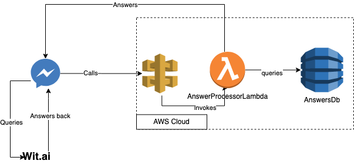

It means that when your page gets a message the following happens:

* Messenger will query Wit.ai to get an interpretation of the message received;
* Wit.ai will answer back to Messenger with a list of intents and entities for the message received (the list can be empty!);
* Messenger will send he wit answer together with the original message to your Webhook (which was configured with Api Gateway);
* Your lambda will look for a answer for the question in your answer database;
* Your lambda will send the answer back to Messenger, which will show it to your customers; 

This architecture solution is good if you want to deploy your bot only to Facebook Messenger. If you want to deploy it to more platforms (such as Whatsapp, your own website or Telegram), you will have to query wit.ai on the Lambda (because not every platform will have the option to integrate with wit.ai, as Messenger does). In my experience, querying wit.ai on lambda increases the latency a little bit. Probably, after following the steps of this tutorial, you will be able to figure out how to change this application to be used with many other platforms.

[Back to top](#Table-of-contents)

## 4. Set up your wit.ai application 


Wit.ai is the core of the Natural Language Processing of your bot. To set up your wit.ai application, follow the steps bellow:

1. First, login or create a free account in wit.ai webpage using your facebook credentials. 

2. On the main dashboard you should click on the “new” button to create a new application. Choose the name of the app and the language, and if you would like to let it public or not. Do not import any backup file.

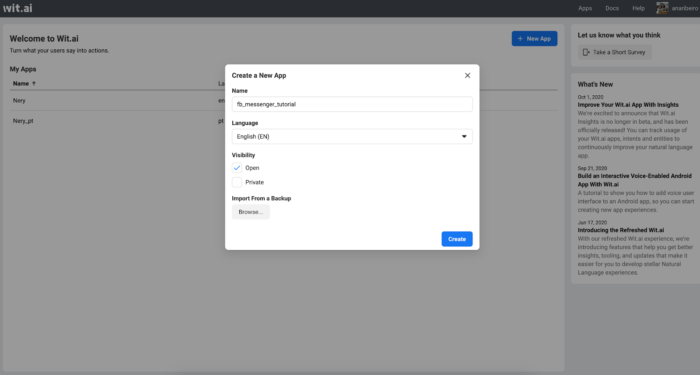

3. Then, after creating your application, you are going to create the intents. Let’s call the first intent defined in the second section as “how_to_order” and the second one “shipping_available”. On your wit.ai portal, select the application you just created, and go to the management menu and select intent, then press the button “+ Intent” and type the name we just defined. Do this for each intent you want to create.

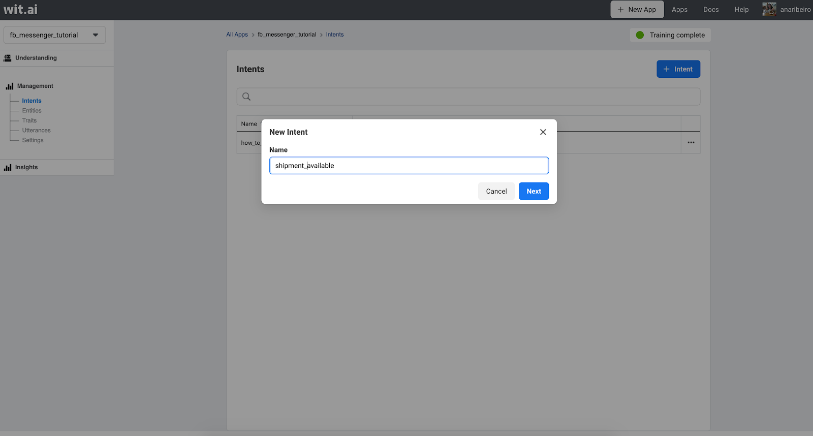

4. Now is time to create the entity for city, go to the entities page  and hit the button “+ Entity”. You can use three strategies for looking up to entities: Free Text, Keywords or a combination of both cases. In this case you are going to use “Free Text & Keywords”, but if you want understand more why, read about it on [wit.ai page](https://wit.ai/docs/recipes#which-entity-should-you-use)

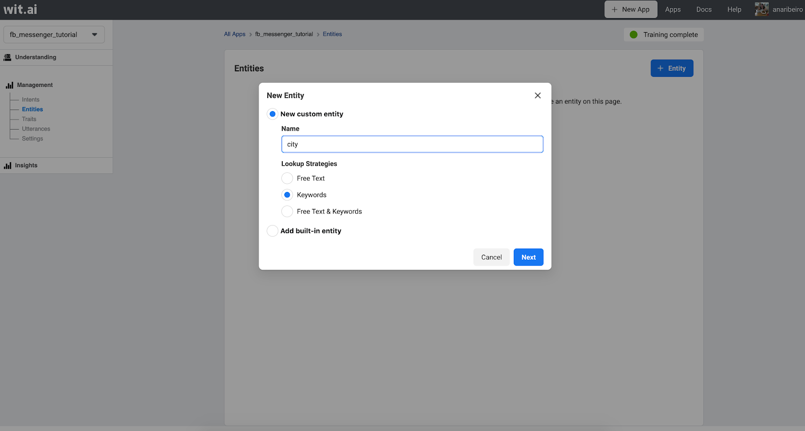

5. Then you are going to add keywords and synonyms to these entities. Under the Entities page, select the entity you just created and click on “Add a new keyword”, for New York the keyword I’m going to add is “NYC”. Hit the button save.

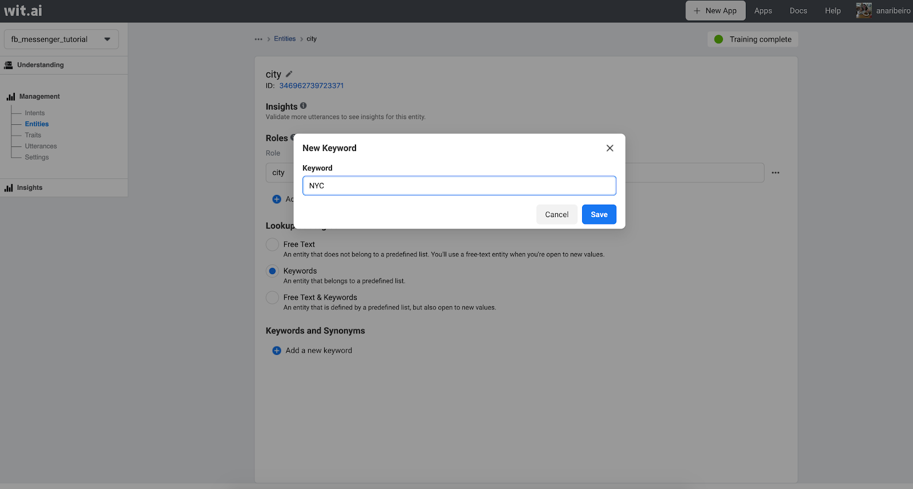

6. Now you should add synonyms on the same page you created the keyword. Add as many synonyms you want. 

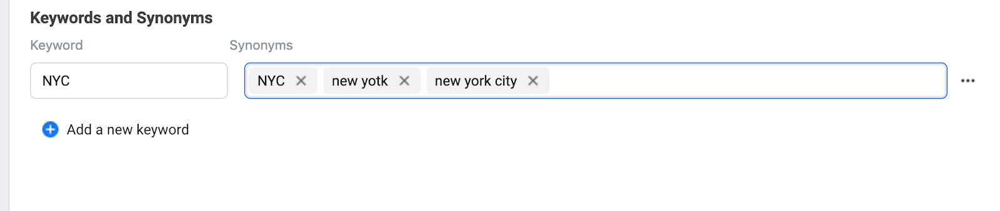

Do this process over and over again to create as many keywords you wish.

Last, but not least, it’s time to train your application. I’ll show you how to do it for each intent on the step 7 and 8 bellow.

7. Click on the menu item “Understanding”. In the main box there, type a utterance (phrase) that could be translated to the “how_to_order” intent you just created and choose this intent from the intent list. Click on the button “Train and Validate”. Do it for as many possibilities you may think of asking this kind of question,  Wit.ai intelligence will infer more precisely if it has more examples.

8. Now for the second type of question (that has an entity to it), type the question as you did before (for instance, “Do you ship to NYC?”) and choose the right intent. Probably Wit.ai interface will recognize the entity in the phrase but if it don’t, just select the word that is a entity (in this case NYC) and choose which entity it is (in this case, City). Hit the button “train and validate”.

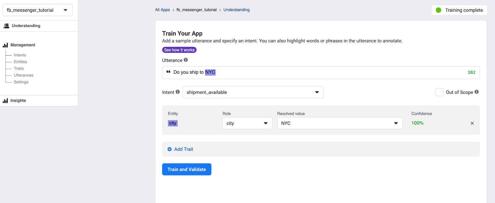

After following those steps for as many utterances and entities you want to add, your Wit app is ready to integrate with Messenger. But before doing that, follow the 10th step:

10. visit the “Setting” page under management and you will have to copy the “Server Access Token” to use later when you set up your messenger app:

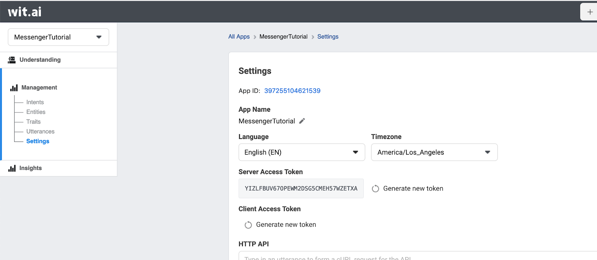

[Back to top](#Table-of-contents)


## 5. Set up your webhook with API Gateway and Lambda

Before setting up your messenger app, you will need to setup a Webhook that your messenger app will call every time it receives a message. Beforehand, Facebook does a verification that your webhook is yours. Basically, it does a GET request with the following parameters: 

* **hub.mode**: Set to subscribe
* **hub.verify_token**: You’ll provide a token when you set up your messenger page.
* **hub.challenge**: Generated by the Messenger Platform. Contains the expected response. You should return it.

As I said before, in this tutorial you are going to use AWS Serverless technologies. To do that, follow the steps bellow:

1.  open your AWS account, and search for Lambda. Under the Lambda page, select the “Functions” item on the menu and hit the button “Create a Function”. Select the option “Author from Scratch”, give it a name such as “MessengerTutorial”, select “Python3.8” as the runtime and hit the button “Create function”.

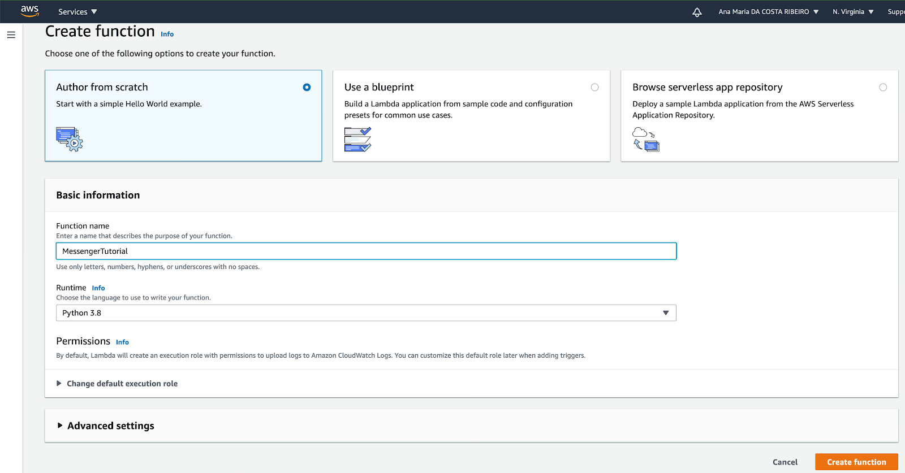

2. Now, under the function list, select the function you just created and there you will be able to edit the code deployed to your function. You should copy and paste the following code snippet there and click the button “deploy”, this code does the verification I just talked about.

> ***Note**: the token is hardcoded just because it is a 1 time deployment, ideally it should be an environment variable*

```python
def lambda_handler(event, context):
    my_token = 'xxx'
    if (event['queryStringParameters']['hub.verify_token'] == my_token):
            return event['queryStringParameters']['hub.challenge']

```

3. Go back to the main page of your AWS console and search for “API Gateway”, and click on “Create API”, and select “HTTP API”.  Integrate it with the lambda you just created and give it a name and click on “Review and Create”. It will generate a Invoke URL for your API, which you should copy because it is the webhook you are going to user later. By default, AWS will create a endpoint that receives any kind of requets under `https://<invoke-url>/<API-NAME>`, for instance `https://2tvmim5n4.execute-api.us-east-1.amazonaws.com/MessengerTutorial`

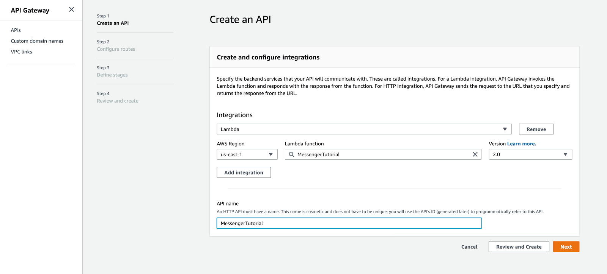

Now you are good to go!

> ***Pro-tip**: if you are going to create this for a prod environment (not just a tutorial), you should use some Infrastructure as Code tool, such as CloudFormation or AWS CDK*

[Back to top](#Table-of-contents)

# 6. Set up your Messenger application

1. Login to your facebook account and visit the [Facebook for developers app page](https://developers.facebook.com/apps/). Now hit the button “create app”, select you are going to create an app to “Manage Business Integrations”. Fill the form with the app name and details, and hit the button “Create App ID”.

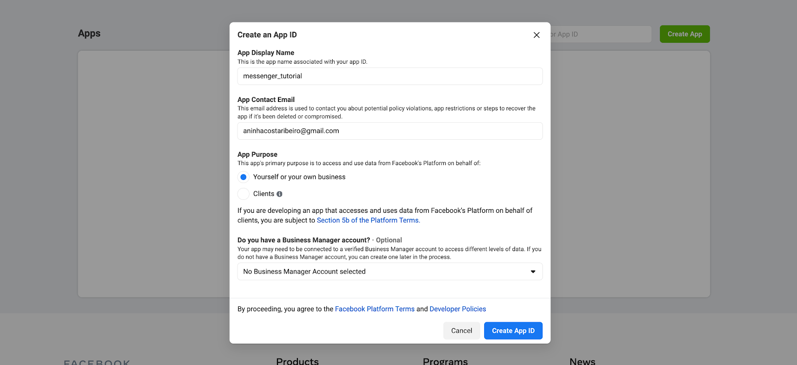

2. In the app settings page, click on Messenger and under “Access token”, add the Facebook page you created previously for this tutorial. Then after adding that page, generate a token and save it in a secure place (Attention, this token is not the same you are going to use to verify the webhook).

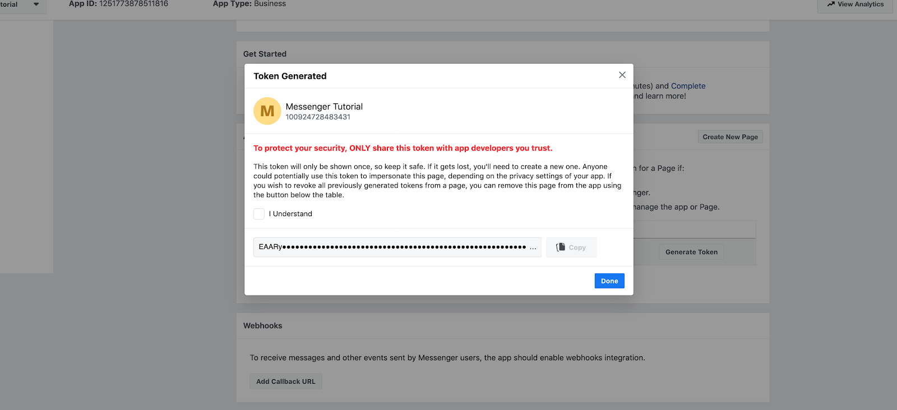

3. Under the page section “Webhooks”, click in “Add callback URL” and use the Invoke URL you saved in the step 5.3 of the tutorial as a callback url and set a token (the one which should be already in your code). Click on “Verify and Save”. It should verify your URL and save the callback URL. 

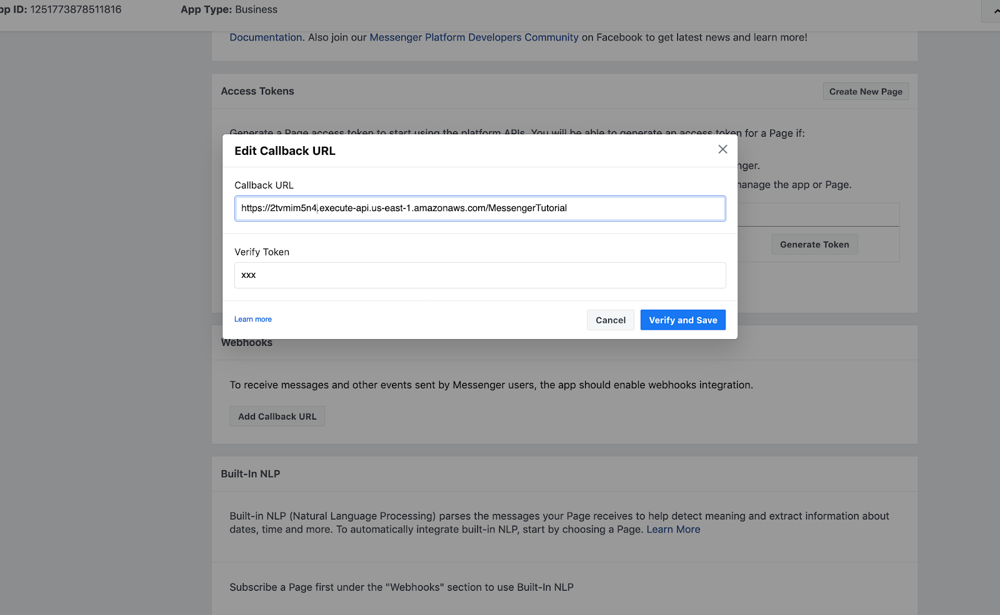

4. After the callback URL is saved, you should click on “Add Subscriptions” button and select “messages”, that means that every time your page get a message, Facebook will call your URL.


5. Now, under “Built in NLP” page section, choose the page you just created to add a Natural Language Processing model the select that built in NLP is on, then choose “Customer model” under the list of possible models. Then add the “Server Access Token” you saved on 4.10 section of this tutorial. 

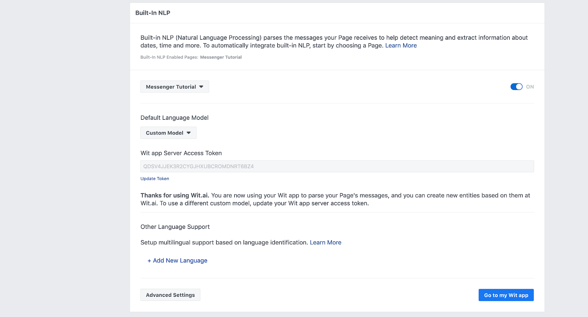

[Back to top](#Table-of-contents)

## 7. Set up your database

With what you’ve done so far, Facebook will query your wit.ai app and send a request to your lambda everytime it gets a new message. But now you should store the answer for that messages in your database.

You may be asking yourself why use a database, and not in an in memory data structure such as a dictionary to store answers, the answer is very simple: if you do like that, you will have to redeploy your app every time you want to add a new question, it it may cause down times and you will have more chance to add bugs into production.

You are going to use for this tutorial the database DynamoDb. DynamoDb is a fully managed NoSQL database. Some of the advantages of NoSQL when compared to SQL databases is that different entries to the database can have different structures because it’s based in a JSON structure, and it is optimized for search operations when compared to SQL databases. If you have performance issues with your DynamoDb you can additionally configure DAX (DynamoDb Accelerator) that creates a cache of your database to quicker access. For this tutorial, you are not going to use something as cache but you could in a real life application.

The key of your database will be the intent of your client, and it may have direct answers for those questions or answers depending on the intent. So the structure of you database would be something like:

```json
{
  "Answer": "Go to example.com and order online there",
  "Intent": "how_to_order"
}

{
  "city": {
    "NYC": "Yes, it'll be shipped in 3 days",
    "Other": "Not yet, sorry",
    "SFO": "Yes, it'll be shipped in 2 days"
  },
  "Intent": "shipping_available"
}
```

To do that follow the steps:

1. Go to your AWS Console and search for DynamoDb, click on “Create Table”, put something as “IntentTable” as table name, and “Intent” Primary Key, click on "create" button and wait to the table to be created:

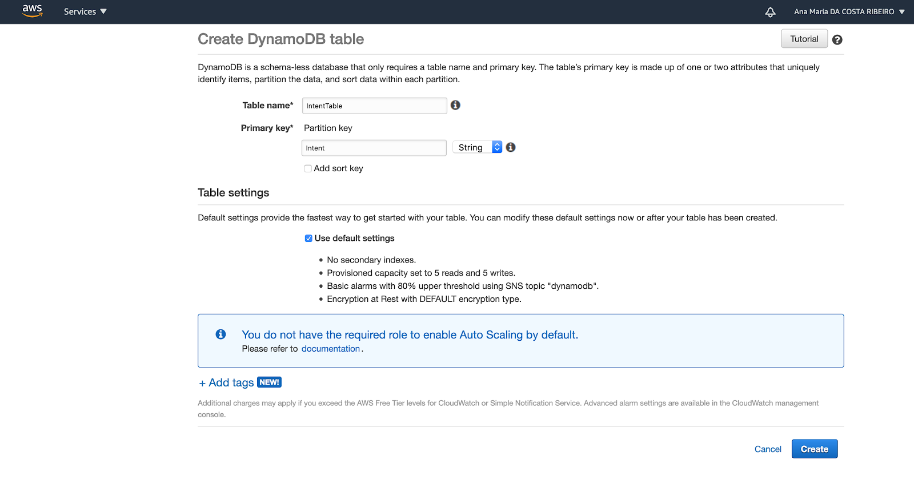

2. Then, when you table is ready go to “Items”, and click on “Create item”;

3. When that opens, change the visualization mode from “tree” to “text”, and copy the JSON structure we defined above. 1 item per intent.

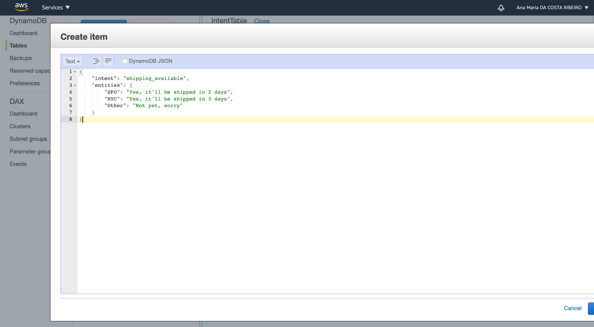

4. Before going to the next step, you will add the permission for the lambda you created in section 5 to access this database. Go back to the main page of your console, and search for IAM. In the IAM page, go to the “roles” subpage. AWS by default creates a role for every lambda function, search for the role created to your lambda (For instance, mines is `MessengerTutorial-role-rfeeh3nt`), then click on it;

5. In the page of your role, click on “Attach Policies” and look for the policy `AmazonDynamoDBReadOnlyAccess` and then click on `Attach policy`.

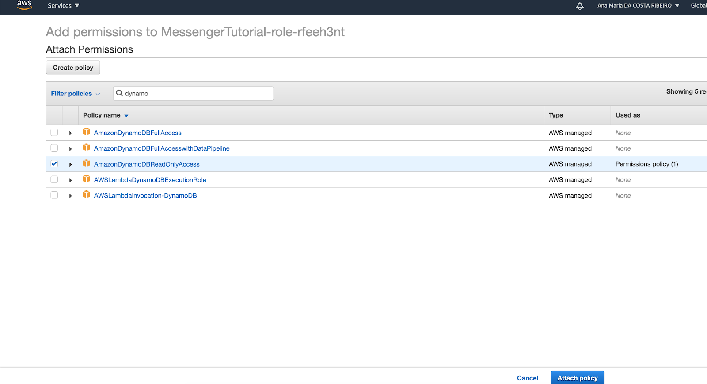

This will allow your lambda read any table on your DynamoDb, if you want a more granular policy (such as specifying the table) you should use tools such as CloudFormation or AWS CDK.

[Back to top](#Table-of-contents)

# 8. Implement your Lambda function

Now, it’s time to make your lambda function to get the right answer from the database and send it to the client. You should use multiple modules and classes in a real life application, but for simplicity this tutorial will show everything in a single module.

So you are going to implement four methods inside the lambda you created on Section 5 of this tutorial. They are the following ones:

* **lambda_handler**: The default method that is invoked when your lambda is called, somehow our main method;
* **decide_answer**:  It will query the database for the best answer according to the message received, it returns a String;
* **send_message**: it will send the message to your facebook account, it returns nothing;

Beforehand, you should know that the important parts of the message you lambda are going to get is the following one, in a real life application you should use “x-hub-signature” to verify if the message is really from Facebook (but for simplicity, this tutorial doesn’t do that), and the body will be used to get the entities and the intents from it:

```json
{
...
   "headers":{
...
      "x-hub-signature":"sha1=0f2aee9f347e8d80e212cebc1c91a1b4d5eeea6"
   },
...   "body":'{"object":"page","entry":[{"id":"100924728483431","time":1603640677983,"messaging":[{"sender":{"id":"32303620374447"},"recipient":{"id":"100924728483431"},"timestamp":1603640677875,"message":{"mid":"m_Lc2G7LdrUXrGv1t_cQA4fYK6oR002DuKOG6_oGmKyz6enpBrJOw3KP55OwCk8pp31xi0vVFEFgPk37c8S28xDw","text":"Do you ship to NYC?","nlp":{"entities":{"intent":[{"confidence":0.93422612890856,"value":"shipping_available"}],"city":[{"confidence":1,"value":"NYC","type":"value"}]},"detected_locales":[{"locale":"en_XX","confidence":0.9954}]}}}]}]}',
   "isBase64Encoded":False
}
```

So, let’s get started:

1. First, you need to get the token you saved in section 4.2, with that in hands go to your lambda function console and under “Environment variables” click on “Manage environment variables”. Then click on “Add environment variable”, as key choose something like “FB_TOKEN” and in value put the token Facebook generated for you, then click on save:

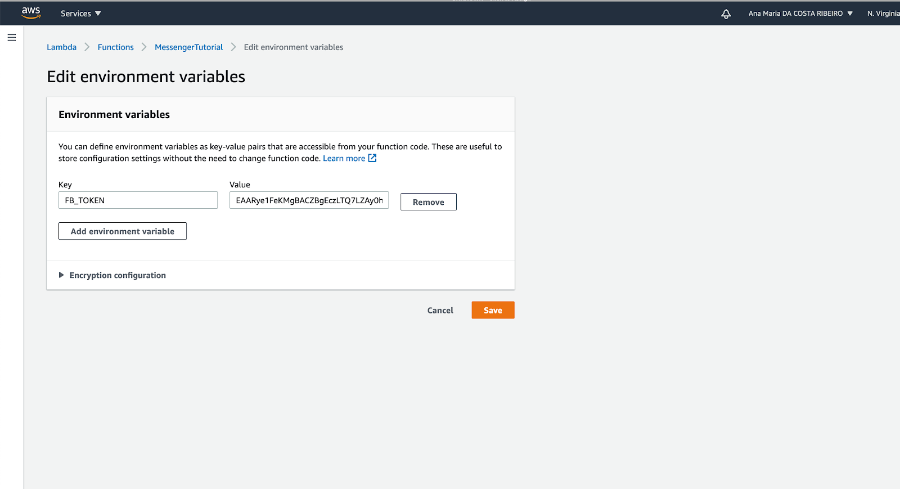

2. Now you are going to add the function that queries the database, you can see all the constant values used here in the code folder:

```python
def decide_answer(body):
    nlp_entities = body['entry'][0]['messaging'][0]['message']['nlp']['entities']
    
    if ('intent' in nlp_entities) and (nlp_entities['intent'][0]['confidence'] > MIN_CONFIDENCE):
        dynamodb = boto3.resource('dynamodb', region_name = REGION)
        table = dynamodb.Table(TABLE)
        try:
            # Querying the database
            table_item = table.get_item(Key={'Intent': nlp_entities['intent'][0]['value']})['Item']

            # Looking for a direct answer
            if('answer' in table_item):
                return table_item['answer']
            else:
                # Checking if the message has a valid entity
                entity = list(table_item.keys() & nlp_entities.keys())
                if len(entity) == 1:
                    entity_value = nlp_entities[entity[0]][0]['value']
                    if(entity_value in table_item[entity[0]]) and (nlp_entities[entity[0]][0]['confidence'] > MIN_CONFIDENCE):
                        return table_item[entity[0]][entity_value]
                    else:
                        return table_item[entity[0]][OTHER]
        except:
            return ERROR_ANSWER
           
    return ERROR_ANSWER

```

3. Now you should implement the function that sends the message back to facebook:

```python
def send_response(message, body):
    token = os.environ['FB_TOKEN']
    url = 'https://graph.facebook.com/v2.6/me/messages?access_token=' + token
    payload = {
            'recipient': body['entry'][0]['messaging'][0]['sender'],
            'message': {
                "text": message
        }
    }
    requests = urllib3.PoolManager()
        headers = {
                'Content-Type': 'application/json'
        }
        response = requests.request(
            'POST',
            url,
            body=json.dumps(payload),
            headers=headers
    )

```

5. Last, but not least, put everything together on lambda_handler:

```python
def lambda_handler(event, context):
    body = json.loads(event['body'])
    message = decide_answer(body)
    send_response(message, body)

```

Now you can click on deploy button on your lambda console, wait a few seconds, and test on your Facebook page to see if it works:

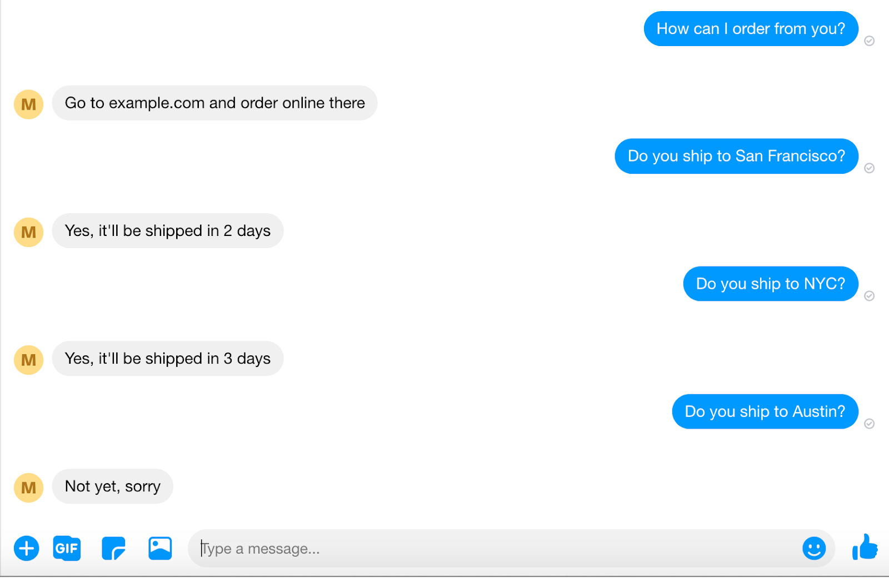

[Back to top](#Table-of-contents)

## 9. Next Steps

Now that you learned the basis of how Wit.ai and Facebook Messenger works and how to create a functional application for them, here are some ideas that you could try:

1. Try to modify your app to send [Quick Replies](https://developers.facebook.com/docs/messenger-platform/send-messages/quick-replies/) to your user;
2. Add more platforms to it, such as Whatsapp or your own React Native App;
3. Try to enable voice recognition on it! So if users send audio messages, they can get answers;
4. Notify a human if the bot cannot answer the person;
5. You could use [sentiment analysis](https://medium.com/wit-ai/%EF%B8%8F-new-sentiment-analysis-entity-%EF%B8%8F-52925e434e32) to get how your clients felt in the conversation;

[Back to top](#Table-of-contents)